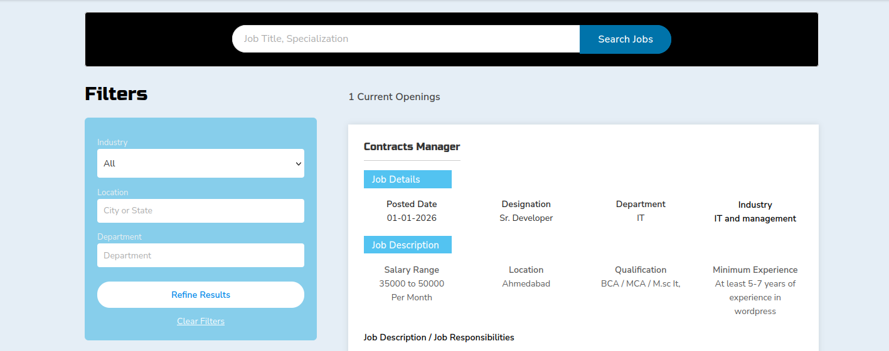
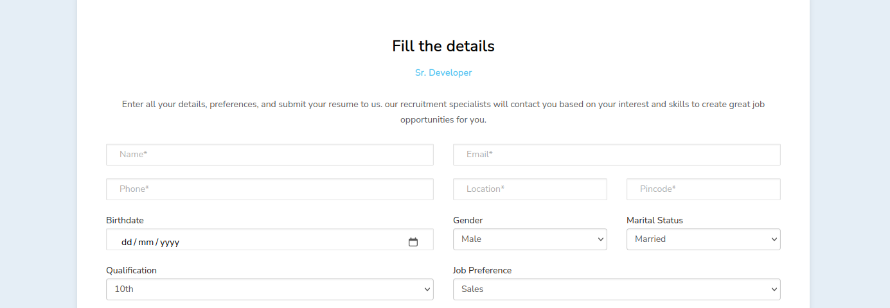
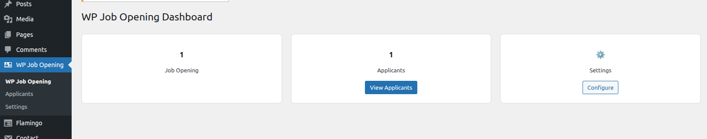
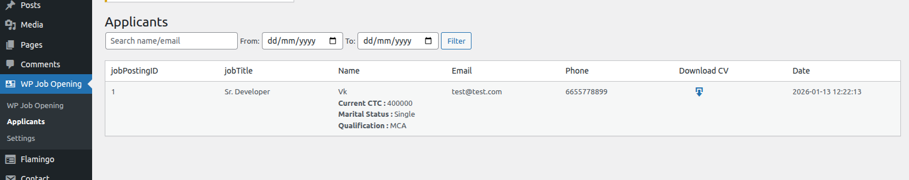

=== WP Job Opening ===
Contributors: Vandana
Tags: jobs, job opening, career, recruitment, contact form 7, cv upload
Requires at least: 5.5
Tested up to: 6.5
Requires PHP: 7.2
Stable tag: 1.0.0
License: GPLv2 or later
License URI: https://www.gnu.org/licenses/gpl-2.0.html

WP Job Opening allows you to list job openings and collect CV applications using Contact Form 7, with full applicant management in the admin dashboard.

== Description ==

WP Job Opening is a simple and powerful job listing and applicant management plugin for WordPress.

It allows website owners to display job openings on the frontend and collect candidate applications using **Contact Form 7**. All submitted applications are stored securely and can be viewed directly from the WordPress admin panel.

### Key Features

* Display all job openings on the frontend
* Dedicated job detail pages
* Apply for jobs using Contact Form 7
* CV upload support
* Store applications securely in the database
* View all applicants in the WordPress admin dashboard
* Download applicant CVs from admin
* Search and filter applicants
* Clean and user-friendly admin interface
* Secure access for authorized users only

WP Job Opening is ideal for companies, HR teams, and recruiters who want a lightweight job management solution without third-party services.

== Installation ==

1. Upload the `wp-job-opening` folder to the `/wp-content/plugins/` directory
2. Activate the plugin through the **Plugins** menu in WordPress
3. Create job openings from the admin dashboard
4. Create a Contact Form 7 form for job applications
5. Use the provided shortcode to display job listings

== Usage ==

1. Add job openings from **WP Admin → WP Job Opening**
2. Create a Contact Form 7 form with CV upload field
3. Assign the form to job openings
4. Display jobs on any page using the provided shortcode
5. View submitted applicants in **WP Admin → WP Job Opening → Applicants**

== Shortcodes ==

`[wp_job_list]`  
Displays all available job openings on the frontend. Require to create page and set shortcode inside that page. You can seel all jobs with ajax filter.

== Frequently Asked Questions ==

= Does this plugin require Contact Form 7? =
Yes. Contact Form 7 is required to handle job application submissions.

= Where are applications stored? =
All applications are stored securely in the WordPress database and accessible from the admin panel.

= Can I download applicant CVs? =
Yes. CVs can be downloaded directly from the Applicants admin page.

== Screenshots ==

1. Job listings on the frontend  
2. Job detail page with application form  
3. Admin dashboard overview  
4. Applicants list with CV download  

== Changelog ==

= 1.0.0 =
* Initial release
* Job listing functionality
* Contact Form 7 integration
* Applicant management dashboard

== Upgrade Notice ==

= 1.0.0 =
Initial release of WP Job Opening.
